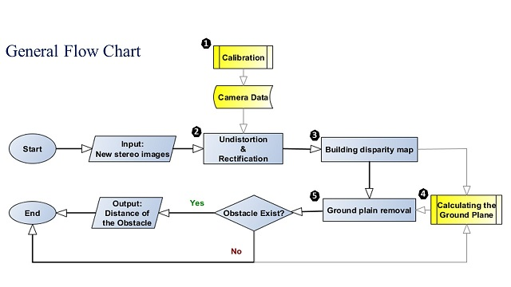

# Stereo_Vision_Based_Obstacle_Detection
Obstacle detection is one the most important tasks for any autonomous mobile robot. Over the last five decades, therefore, numerous techniques has been proposed to detect a moving object and to measure the distance of the obstacle to the robot. Stereo vision techniques are of great importance in this line of research and application. State of the art capabilities of these methods have been demonstrated in terms of speed, accuracy and time consumption. However, stereoscopic matching to solve the correspondence problem is a central issue to derive three-dimensional information, disparity map. Here, taking the advantage of Robotic Operation System and a robotic specialized library called OpenCV, an obstacle localization algorithm was proposed which relies on block matching to calculates disparity map from the intensity images captured by a stereo camera. Our simulations showed the proposed algorithm has efficient temporal qualities. In the best case, using a core i-7 PC with 2.4 GHz CPU, the processing rate can reach 45 frames per second for an image with 640 × 480 pixel size (1/3 pixels are in ROI).

This work consists of the following main steps:

1- Camera Calibration

2- Image Undistortion and Rectification

3- Building Disparity Map

4- Classification and Recognition

5- Object Characteristics and Image Understanding

As it can be seen in the flow chart, besides the main processing path, two sub-functions are highlighted in yellow. 
I’m going to explain the blocks following the numbers because the other blocks don’t have much to explain.

We are going through most of the main steps of a traditional image processing algorithm.

2- Undistortion and rectification are pre-processing steps. They will prepare the image to be analyzed in the next steps.

3- Building disparity map is a mid-level feature extraction step that will give us some 3D information about the scene.

5- Recognition of the obstacle and computing the distance occurs in the 5th step.

Sample1: https://youtu.be/rTAmvsUGNlw

Sample2: https://youtu.be/9wm0IUBoThA
